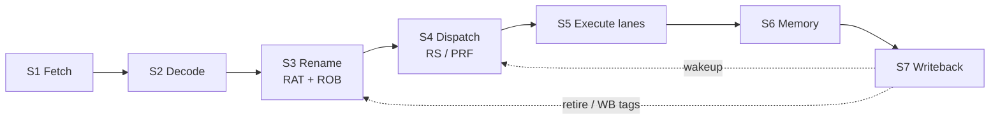

# RISC-V Dual-Issue Out-of-Order Processor (RV-DIS)

## 1. Project Overview

SystemVerilog design of a small RISC-V CPU:

- **ISA:** RV32I only (no M/A/F/D)
- **Fetch/decode:** up to two instructions per cycle on fixed even/odd lanes (I0 / I1)
- **Execute:** out-of-order via rename, ROB, and reservation station

This is a learning/verification project -- an OoO dual-issue pipeline you can simulate in RTL, not a production SoC.

Goals:

- Keep stages separable so each unit can have its own testbench
- Compare directed tests against C++ golden models via DPI-C
- Favor readable structure over max IPC or area

See also: [`project_outline.txt`](project_outline.txt), [`arm_spu_spulite_project_spec.txt`](arm_spu_spulite_project_spec.txt).

---

## 2. Features

| Feature | Notes |
|---------|-------|
| Dual-issue fetch/decode | Two static lanes (I0/I1); simpler than a fully dynamic issue width |
| Register rename + ROB | Kills WAR/WAW via the PRF; commits in order |
| Dual-path speculation maps in the RAT | Speculative and recovery paths keep separate alias maps until a branch resolves |
| Reservation station (bank + select) | Ready bank/rename ops can issue same cycle; unready ones wait in the bank |
| Even/odd execute lanes | Separate ALU/branch/mem address paths matching the dual-issue split |
| Directed TBs + one UVM rename suite | Unit tests for most blocks; full rename glue exercised in UVM |
| C++ golden models (`model/`) | Same stimulus as RTL, independent reference for RAT/ROB/fetch/etc. |

---

## 3. Directory Structure

```text
.
├── README.md                 # this file
├── project_outline.txt       # long-form design notes (ports, behavior)
├── arm_spu_spulite_project_spec.txt
├── rtl/                      # synthesizable SystemVerilog
│   ├── import/               # shared packages (rv_dis_pkg, cache_pkg)
│   ├── s1_fetch/ … s7_wback/ # pipeline stages
│   └── top/risc_dis_unit.sv  # chip-level glue
├── model/                    # C++ DPI golden models (by stage)
├── tb/                       # testbenches, DPI shims, UVM
│   ├── common/utils/         # tb_console.svh (PASS/FAIL dumps)
│   ├── dpi/                  # dpi_pkg.sv + shims/<stage>/
│   ├── uvm/rename/           # rename_core_struct UVM
│   └── s1_fetch/ …           # directed tests/ (+ optional infra/)
├── sim/                      # python sim/run.py control panel
│   ├── config/<stage>/       # per-TB JSON (dpi_cpp, extras)
│   ├── lib/                  # xsim / questa / …
│   └── results/              # logs (gitignored)
├── program/                  # asm / hex / small assembler
└── docs/                     # ISA + architecture notes
```

**Naming mismatch:** RTL uses `s5_execution`, `s6_memory`, `s7_wback`; TBs use `s5_execute`, `s6_wback`. Same pipeline stages -- the names just diverged over time.

Stage-specific notes:

- [`tb/s3_rename/README.md`](tb/s3_rename/README.md)
- [`tb/s4_dispatch/README.md`](tb/s4_dispatch/README.md)
- [`sim/README.md`](sim/README.md) -- runner flags
- [`model/README.md`](model/README.md) -- DPI golden timing

---

## 4. Architecture

### Pipeline

```text
Fetch → Decode → Rename → Dispatch/Issue → Execute → Memory → Writeback/Retire
  S1      S2       S3           S4              S5        S6         S7
```

OoO starts after rename. The ROB tracks program order, the RS holds ops until sources are ready, results go to the PRF, and retire updates architectural state in order.



### Stage roles

- **Fetch/decode** stay mostly in-order and dual-issue friendly.
- **Rename/ROB** own precise state and branch path recovery.
- **Dispatch** is two peers under `dispatch_core`:
  - `reservation_station` -- bank + select (ready/pick/issue); controls/tags only, no operand data
  - `physical_register` -- physical regs; operands read at issue into DP/EX
- **`dp_ex`** (dispatch-to-execute register) lives at the top (`risc_dis_unit`), not inside dispatch. It demuxes the dual issue pair onto even0 / even1 / odd0 / odd1 by lane select.

### Speculative paths

Two speculative paths (path0 / path1) with flags like `spec_en` / `path_use`. On mispredict or flush, maps and queues recover from the RRAT or flushed state. Per-block details differ -- check `alias_table` and RS path squash before changing behavior.

---

## 5. Module Descriptions

Common modules only. Full port lists are in `project_outline.txt` and the `.sv` headers.

### S1 -- Fetch (`rtl/s1_fetch/`)

| Module | Job |
|--------|-----|
| `pc` | Dual PCs + per-lane spec flags; advances unless stalled |
| `pc_selector` | Next PC bases (sequential vs predict/recover) |
| `instruction_cache` | Up to two instructions for the PCs |
| `target_buffer` | BTB-style predicted targets |
| `fetch_core_struct` | Wires the above |

**In:** clock/reset, stalls, predict/recover from later stages.
**Out:** PC pair, instructions, valids, spec flags into decode.

### S2 -- Decode (`rtl/s2_decode/`)

| Module | Job |
|--------|-----|
| `if_id` | Fetch-to-decode pipeline register |
| `decoder` | RV32I fields: opcode, rd/rs1/rs2, imm, use flags |
| `state_buffer` / `target_predict` | Branch history / predict helpers |
| `decode_core_struct` | Stage glue |

**Out:** control + arch registers + immediates toward rename.

### S3 -- Rename (`rtl/s3_rename/`)

| Module | Job |
|--------|-----|
| `alias_table` | RAT + RRAT. Maps arch `x*` to PRF tags; dual speculative maps; flush from RRAT |
| `reorder_buffer` | Alloc at tail, complete on writeback, retire at head |
| `rename_core_struct` | RAT + ROB together (UVM only, no directed TB) |

**PRF tags:** arch `x0`-`x31` plus rename temps (usually **p32-p63** from ROB index). Unused sources use **p0** (always ready / hardwired zero).

### S4 -- Dispatch / issue (`rtl/s4_dispatch/`)

| Module | Job |
|--------|-----|
| `rn_dp` | Rename-to-dispatch register |
| `dispatch_core` | Glue for RS + PRF |
| `reservation_station` | Bank + select (ready / 4→2 pick / issue mux); ↓clk clear/age/store |
| `physical_register` | Physical register storage + read ports at issue |

**Flow:** up to two oldest ready bank entries and two ready rename lanes form a four-candidate pool; the two oldest issue. RS keeps the bank internal (no bank ports). PRF supplies operand data into DP/EX.

### S5-S7 -- Execute / memory / writeback

| Area | Folder | Role |
|------|--------|------|
| Execute | `rtl/s5_execution/` | Even/odd lanes (ALU, branch, address) |
| Memory | `rtl/s6_memory/` | EX/MEM, data cache path |
| Writeback | `rtl/s7_wback/` | Merge toward retire / WB buses |
| Top | `rtl/top/risc_dis_unit.sv` | Instantiates the pipeline |

S5-S7 are present but still evolving. Unit TBs cover several pieces; full-core software bring-up is thinner. Check `project_outline.txt` status tags (`Verified` / `Proof TBD`).

---

## 6. Design Decisions

| Choice | Alternative | Why |
|--------|-------------|-----|
| Static dual-issue (I0/I1) | Dynamic 2-wide from one queue | Easier decode/issue wiring for a student-scale core |
| ROB-owned PRF tags (no free list) | Classic free-list rename | Fewer structures; tags tied to ROB slots (p32+) |
| Dual RAT maps (`map_br0` / `map_br1`) | Single map + checkpoint stack | Matches dual-path speculation used elsewhere |
| Dispatch = RS owns bank+select; helpers in `rs.sv` | Separate selector + bank ports | Avoids porting the bank association out of RS |
| Directed TB + C++ GM for RAT/ROB | Only UVM / only RTL self-check | Fast local regressions; UVM kept for full rename glue |
| Negedge update on RAT/ROB/RS bank | Pure posedge everywhere | Aligns WB-complete to next-cycle retire/issue; TBs drive posedge, commit on negedge |
| XSim default via Python | Only vendor GUI flows | One command: `python sim/run.py <top>` |

Dual-path maps and separate issue units add control complexity, but they make unit testing easier.

---

## 7. Build and Usage

### Prerequisites

- Python 3.10+
- Vivado / XSim on `PATH`, or set `VIVADO` to `vivado.bat`
- Optional for UVM: Questa / VCS / Xcelium (see `sim/README.md`)

### Check tools

```powershell
python sim/run.py doctor
python sim/run.py --list
```

### Run a directed testbench

```powershell
python sim/run.py pc_tb
python sim/run.py alias_table_tb
python sim/run.py reorder_buffer_tb
python sim/run.py reservation_station_tb
python sim/run.py dispatch_core_tb
```

Aliases:

```powershell
python sim/run.py rat_tb            # -> alias_table_tb
python sim/run.py allis_table_tb    # old spelling -> alias_table_tb
```

### Run rename UVM

```powershell
python sim/run.py rename_uvm --test rename_smoke_test
```

UVM on XSim has historically had timescale/library issues; Questa tends to work better for `rename_uvm`. If it fails, check `sim/results/.../compile_run.log` before changing RTL.

### Logs

```text
sim/results/<top>/xsim/compile_run.log
```

XSim prints compile sources in groups: `pkg`, `dut`, `model`, `test`, ...

### Synthesis

Outline mentions Yosys via `scripts/run_yosys.ps1`. Confirm that script exists in your checkout before relying on it.

---

## 8. Testing

### Layout

| Kind | Where | What it checks |
|------|-------|----------------|
| Directed unit TB | `tb/<stage>/tests/*_tb.sv` | One DUT (sometimes + subunits) vs expect or vs C++ GM |
| DPI shim | `tb/dpi/shims/<stage>/` | SV wrapper around C++ `*_dpi_eval` / `*_dpi_commit` |
| C++ golden | `model/<stage>/` | Independent behavior model |
| UVM | `tb/uvm/rename/` | `rename_core_struct` integration |
| Config | `sim/config/<stage>/<top>.json` | Extra SV sources + `dpi_cpp` list |

Typical directed pattern (RAT/ROB):

1. Drive inputs on **posedge**
2. `#0` then compare combo outputs to golden
3. Hold through **negedge** so DUT and golden commit together

Console helpers: `tb/common/utils/tb_console.svh` (`tb_summary`, field dumps, `clk_edge`).

### What major TBs verify

| Command | Verifies |
|---------|----------|
| `alias_table_tb` | RAT/RRAT lookups, alloc, path copy, flush, RAW bypass, random stress |
| `reorder_buffer_tb` | Alloc / WB / retire, stores, branches, OOO WB, path, stall, flush |
| `reservation_station_tb` | Rename bypass, RAW store, path filter, flush |
| `dispatch_core_tb` | RS + PRF glue (dual issue, RAW, path filter) |

List everything the runner knows:

```powershell
python sim/run.py --list
```

Note: `tb/s4_dispatch/tests/register_file_tb.sv` still mentions a legacy `register_file` DUT and is not wired into `sim/run.py` / `.slang/project.f`. Current PRF RTL is `physical_register`.

---

## 9. Future Improvements

- Vector / SIMD extension (core is scalar RV32I for now)
- More program-level runs through `program/` + `risc_dis_unit`
- Stabilize `rename_uvm` on XSim, or document Questa-only
- Directed TB for `physical_register` (replace or revive `register_file_tb`)
- Unify TB/RTL folder naming (`s5_execute` vs `s5_execution`)
- Formal proofs -- outline still marks many blocks `Proof - TBD`
- Keep `project_outline.txt` in sync with ports (`[2]` vs `i0_*`); trust the `.sv` when they disagree

Later (once the scalar OoO path is solid): deeper RS, better branch predictor, cache sizing.

---

## 10. References

| Resource | Use |
|----------|-----|
| [`project_outline.txt`](project_outline.txt) | Stage-by-stage behavior and (sometimes outdated) port sketches |
| [`arm_spu_spulite_project_spec.txt`](arm_spu_spulite_project_spec.txt) | Project / course specification text |
| [`docs/isa/README.md`](docs/isa/README.md) | ISA notes |
| [`docs/architecture/README.md`](docs/architecture/README.md) | Architecture index + signal map pointer |
| [RISC-V Unprivileged Spec](https://riscv.org/technical/specifications/) | RV32I encoding and semantics |
| [`sim/README.md`](sim/README.md) | Simulator flags, config JSON, UVM suites |
| [`tb/README.md`](tb/README.md) | Verification layout and stage test map |

---

### Quick lookup

| I want to... | Open |
|--------------|------|
| Change RAT behavior | `rtl/s3_rename/core_mod/alias_table.sv` + `alias_table_tb` |
| Change ROB retire | `rtl/s3_rename/core_mod/reorder_buffer.sv` + `head_retire.sv` |
| Change issue policy | `reservation_station` / `funct_pkg/rs.sv` |
| Add a directed test | `tb/<stage>/tests/`, `sim/config/...`, `.slang/project.f` |
| See last sim result | `sim/results/<top>/xsim/compile_run.log` |
