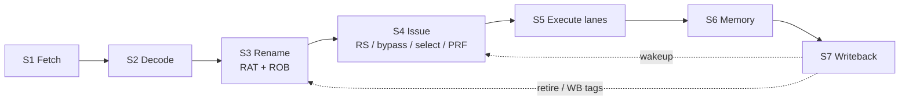

# RISC-V Dual-Issue Out-of-Order Processor (RV-DIS)

## 1. Project Overview

This repo is a **SystemVerilog** design of a small **RISC-V** CPU.

- **ISA:** RV32I (32-bit integer base only — no M/A/F/D extensions in this tree).
- **Fetch / decode:** up to **two instructions per cycle** on fixed even/odd lanes (I0 / I1).
- **Execute:** **out-of-order** through rename, a reorder buffer (ROB), and a reservation station (RS).

**Why it exists:** build and verify an OoO dual-issue pipeline in RTL you can simulate, not a production SoC.

**Main goals:**

- Keep stages separable so each unit can have its own testbench.
- Match directed tests against C++ golden models via DPI-C where it helps.
- Prefer readable structure over maximum IPC / area.

**Assumption:** the repo name says “SIMD,” but the current outline and RTL target a **scalar** RV32I core. Treat SIMD as a future/naming leftover unless you find vector RTL.

More design notes: [`project_outline.txt`](project_outline.txt).  
Course/spec text: [`arm_spu_spulite_project_spec.txt`](arm_spu_spulite_project_spec.txt).

---

## 2. Features

| Feature | Why it’s there |
|---------|----------------|
| Dual-issue fetch/decode | Two static lanes (I0/I1) simplify scheduling vs a fully dynamic issue width. |
| Register rename + ROB | Removes WAR/WAW through the physical register file (PRF); commits in order. |
| Dual-path speculation maps in the RAT | Speculative and recovery paths can keep separate alias maps until a branch resolves. |
| Reservation station + bypass + selector | Lets ready ops issue without waiting in the RS; unready ops wait in the bank. |
| Even/odd execute lanes | Matches the dual-issue split into separate ALU/branch/mem address paths. |
| Directed TBs + one UVM rename suite | Unit tests for most blocks; full rename glue is exercised in UVM. |
| C++ golden models (`model/`) | Same stimulus as RTL, independent reference for RAT/ROB/fetch/etc. |

---

## 3. Directory Structure

```text
.
├── README.md                 # this file
├── project_outline.txt       # long-form design notes (ports, behavior)
├── arm_spu_spulite_project_spec.txt
├── rtl/                      # synthesizable SystemVerilog
│   ├── import/               # shared packages (rv_dis_pkg, cache_pkg)
│   ├── s1_fetch/ … s7_wback/ # pipeline stages
│   └── top/risc_dis_unit.sv  # chip-level glue
├── model/                    # C++ DPI golden models (by stage)
├── tb/                       # testbenches, DPI shims, UVM
│   ├── common/utils/         # tb_console.svh (PASS/FAIL dumps)
│   ├── dpi/                  # dpi_pkg.sv + shims/<stage>/
│   ├── uvm/rename/           # rename_core_struct UVM
│   └── s1_fetch/ …           # directed tests/ (+ optional infra/)
├── sim/                      # python sim/run.py control panel
│   ├── config/<stage>/       # per-TB JSON (dpi_cpp, extras)
│   ├── lib/                  # xsim / questa / …
│   └── results/              # logs (gitignored)
├── program/                  # asm / hex / small assembler
└── docs/                     # ISA + architecture notes
```

**Naming mismatch (important):**

- RTL folders: `s5_execution`, `s6_memory`, `s7_wback`
- TB folders: `s5_execute`, `s6_wback`

They mean the same pipeline regions; paths differ on purpose of history, not two designs.

Stage-specific short maps (commands + coverage only):

- [`tb/s3_rename/README.md`](tb/s3_rename/README.md)
- [`tb/s4_dispatch/README.md`](tb/s4_dispatch/README.md)
- [`sim/README.md`](sim/README.md) — runner flags
- [`model/README.md`](model/README.md) — DPI golden timing

---

## 4. Architecture

### Big picture

Instructions move through roughly:

```text
Fetch → Decode → Rename → Dispatch/Issue → Execute → Memory → Writeback/Retire
  S1      S2       S3           S4              S5        S6         S7
```

Out-of-order happens after rename: the ROB tracks program order; the RS holds ops until sources are ready; results write the PRF; retire updates architectural state in order.



### Why this split?

- **Fetch/decode** stay mostly in-order and dual-issue friendly.
- **Rename/ROB** own precise state and branch path recovery.
- **Issue** is four **peer** cores under `issue_core_struct` (not “bypass inside RS”):
  - `reservation_station` — bank + wakeup + alloc
  - `bypass_unit` — “can this dispatch issue this cycle?”
  - `selector_unit` — pick up to two oldest-ready from bank **or** bypass
  - `p_register_file` — physical regs
- **`dp_ex`** (dispatch→execute register) sits at the **top** (`risc_dis_unit`), not inside issue.

### Speculative paths (mental model)

The design tracks two speculative “paths” (path0 / path1) with flags such as `spec_en` / `path_use`. On a mispredict or flush, maps and queues recover from architectural (RRAT) or flushed state. Details differ per block — read `alias_table` and RS path squash before changing behavior.

---

## 5. Module Descriptions

Only the pieces you touch most often. For full port lists, use `project_outline.txt` and the `.sv` headers.

### S1 — Fetch (`rtl/s1_fetch/`)

| Module | Job |
|--------|-----|
| `pc` | Holds dual PCs + per-lane spec flags; advances unless stalled. |
| `pc_selector` | Chooses next PC bases (sequential vs predict/recover). |
| `instruction_cache` | Returns up to two instructions for the PCs. |
| `target_buffer` | Branch target buffer (BTB)-style predicted targets. |
| `fetch_core_struct` | Wires the above. |

**In:** clock/reset, stalls, predict/recover from later stages.  
**Out:** PC pair, instructions, valids, spec flags into decode.

### S2 — Decode (`rtl/s2_decode/`)

| Module | Job |
|--------|-----|
| `if_id` | Fetch→decode pipeline register. |
| `decoder` | RV32I fields: opcode, rd/rs1/rs2, imm, use flags. |
| `state_buffer` / `target_predict` | Branch history / predict helpers. |
| `decode_core_struct` | Stage glue. |

**Out:** control + arch registers + immediates toward rename.

### S3 — Rename (`rtl/s3_rename/`)

| Module | Job |
|--------|-----|
| `alias_table` | Register Alias Table (**RAT**) + Retirement RAT (**RRAT**). Maps arch `x*` → PRF tags; dual speculative maps; flush from RRAT. |
| `reorder_buffer` | Alloc at tail, complete on writeback, retire at head (RRAT / path / store enables). |
| `rename_core_struct` | RAT + ROB together (UVM, not a directed TB). |

**PRF tags:** architectural `x0`–`x31` plus rename temps (commonly **p32–p63** from ROB index). Unused sources use **p0** (always ready / hardwired zero).

### S4 — Dispatch / issue (`rtl/s4_dispatch/`)

| Module | Job |
|--------|-----|
| `rn_dp` | Rename→dispatch register. |
| `issue_core_struct` | Glue for the four peers below. |
| `reservation_station` | Stores unready / unselected ops; wakeup on WB; path squash. |
| `bypass_unit` | Combo ready/age for this cycle’s dispatch pair. |
| `selector_unit` | Oldest-ready pick; drives `pick` / `stall_dp`; uses `rs_issue`. |
| `p_register_file` | Physical register storage + read ports for issue. |

**Flow:** dispatch + WB → bypass readiness → selector picks → RS frees issued bank ways / stores the rest → PRF supplies operand data for the issued pair.

### S5–S7 — Execute / memory / writeback

| Area | Folder | Role (high level) |
|------|--------|-------------------|
| Execute | `rtl/s5_execution/` | Even/odd lanes (ALU, branch, address). |
| Memory | `rtl/s6_memory/` | EX/MEM, data cache path. |
| Writeback | `rtl/s7_wback/` | Merge toward retire / WB buses. |
| Top | `rtl/top/risc_dis_unit.sv` | Instantiates the pipeline. |

**Assumption:** treat S5–S7 as “present and evolving”; unit TBs exist for several pieces, but end-to-end software bring-up may still be thin. Check `project_outline.txt` status tags (`Verified` / `Proof TBD`).

---

## 6. Design Decisions

| Choice | Alternative | Why this way |
|--------|-------------|--------------|
| Static dual-issue (I0/I1) | Dynamic 2-wide from one queue | Easier decode/issue wiring for a student-scale core. |
| ROB-owned PRF tags (no free list) | Classic free-list rename | Fewer structures; tags tied to ROB slots (p32+). |
| Dual RAT maps (`map_br0` / `map_br1`) | Single map + checkpoint stack | Matches dual-path speculation used elsewhere in the design. |
| Issue = four peers | Bypass/select inside RS | Clear unit TBs (`bypass_tb`, `selector_tb`, `reservation_station_tb`). |
| Directed TB + C++ GM for RAT/ROB | Only UVM / only RTL self-check | Fast local regressions; UVM kept for full rename glue. |
| Negedge update on RAT/ROB/RS bank | Pure posedge everywhere | Aligns “WB complete → next cycle retire/issue” comments in RTL; TBs drive posedge, commit on negedge. |
| XSim default via Python | Only vendor GUI flows | One command: `python sim/run.py <top>`. |

**Trade-off:** dual-path maps and peer issue units add control complexity. The payoff is testability and a clearer mental model than one mega-module.

---

## 7. Build and Usage

### Prerequisites

- **Python 3.10+**
- **Vivado / XSim** on `PATH`, or set `VIVADO` to `vivado.bat`
- Optional for UVM: Questa / VCS / Xcelium (see `sim/README.md`)

### Check tools

```powershell
python sim/run.py doctor
python sim/run.py --list
```

### Run a directed testbench

```powershell
python sim/run.py pc_tb
python sim/run.py alias_table_tb
python sim/run.py reorder_buffer_tb
python sim/run.py bypass_tb
python sim/run.py selector_tb
python sim/run.py reservation_station_tb
```

Aliases (same tops):

```powershell
python sim/run.py rat_tb            # → alias_table_tb
python sim/run.py allis_table_tb    # old spelling → alias_table_tb
```

### Run rename UVM

```powershell
python sim/run.py rename_uvm --test rename_smoke_test
```

**Assumption:** UVM on XSim has historically hit timescale / library friction; Questa may be more reliable for `rename_uvm`. If it fails, read `sim/results/…/compile_run.log` before changing RTL.

### Logs

```text
sim/results/<top>/xsim/compile_run.log
```

XSim prints compile sources in groups: `pkg`, `dut`, `model`, `test`, …

### Synthesis (if you use it)

Outline mentions Yosys via `scripts/run_yosys.ps1`. **Assumption:** confirm that script exists in your checkout before relying on it.

---

## 8. Testing

### How tests are organized

| Kind | Where | What it checks |
|------|-------|----------------|
| Directed unit TB | `tb/<stage>/tests/*_tb.sv` | One DUT (sometimes + subunits) vs expect or vs C++ GM |
| DPI shim | `tb/dpi/shims/<stage>/` | SV wrapper around C++ `*_dpi_eval` / `*_dpi_commit` |
| C++ golden | `model/<stage>/` | Independent behavior model |
| UVM | `tb/uvm/rename/` | `rename_core_struct` integration |
| Config | `sim/config/<stage>/<top>.json` | Extra SV sources + `dpi_cpp` list |

Typical directed pattern (RAT/ROB):

1. Drive inputs on **posedge**
2. `#0` then compare combo outputs to golden
3. Hold through **negedge** so DUT and golden commit together

Console helpers: `tb/common/utils/tb_console.svh` (`tb_summary`, field dumps, `clk_edge`).

### What major TBs verify

| Command | Verifies |
|---------|----------|
| `alias_table_tb` | RAT/RRAT lookups, alloc, path copy, flush, RAW bypass, random stress |
| `reorder_buffer_tb` | Alloc / WB / retire, stores, branches, OOO WB, path, stall, flush |
| `bypass_tb` | Dispatch ready, WB wake, same-pair RAW |
| `selector_tb` | Oldest pick from bank+bypass, stall when full, flush |
| `reservation_station_tb` | Store, wakeup, free way, path squash, fill |

List everything the runner knows:

```powershell
python sim/run.py --list
```

**Note:** `tb/s4_dispatch/tests/register_file_tb.sv` still mentions a legacy `register_file` DUT and is **not** wired into `sim/run.py` / `.slang/project.f`. Current PRF RTL is `p_register_file`.

---

## 9. Future Improvements

Known gaps / honest TODOs (not a roadmap promise):

- **SIMD / vector:** name vs RV32I scalar implementation — clarify or implement.
- **Full-core bring-up:** more program-level runs through `program/` + `risc_dis_unit`.
- **`rename_uvm` on XSim:** timescale / UVM lib issues; stabilize or document Questa-only.
- **PRF directed TB** for `p_register_file` (replace or revive `register_file_tb`).
- **TB / RTL folder naming** (`s5_execute` vs `s5_execution`) — unify someday.
- **Proof / formal:** outline still marks many blocks `Proof - TBD`.
- **Docs vs ports:** `project_outline.txt` sometimes lags array-style ports (`[2]` vs `i0_*`); trust the `.sv` file.

Possible optimizations later: deeper RS, better branch predictor, cache sizing — only after the scalar OoO path is boringly correct.

---

## 10. References

| Resource | Use |
|----------|-----|
| [`project_outline.txt`](project_outline.txt) | Stage-by-stage behavior and (sometimes outdated) port sketches |
| [`arm_spu_spulite_project_spec.txt`](arm_spu_spulite_project_spec.txt) | Project / course specification text |
| [`docs/isa/README.md`](docs/isa/README.md) | ISA-oriented notes in-repo |
| [`docs/architecture/README.md`](docs/architecture/README.md) | Short architecture index + signal map pointer |
| [RISC-V Unprivileged Spec](https://riscv.org/technical/specifications/) | RV32I encoding and semantics (external) |
| [`sim/README.md`](sim/README.md) | Simulator flags, config JSON, UVM suites |
| [`tb/README.md`](tb/README.md) | Verification layout and stage test map |

---

### Quick “where do I look?” cheatsheet

| I want to… | Open |
|------------|------|
| Change RAT behavior | `rtl/s3_rename/core_mod/alias_table.sv` + `alias_table_tb` |
| Change ROB retire | `rtl/s3_rename/core_mod/reorder_buffer.sv` + `head_retire.sv` |
| Change issue policy | `bypass_unit` / `selector_unit` / `rs_alloc` |
| Add a directed test | `tb/<stage>/tests/`, `sim/config/...`, `.slang/project.f` |
| See last sim result | `sim/results/<top>/xsim/compile_run.log` |
